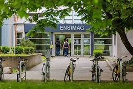

## Notre décodeur JPEG à nous 
Ce projet a pour objectif de construire un décodeur JPEG capable de lire une image compressée 
en format `.jpg` et de générer en sortie une image affichable au format `.ppm` ou `.pgm`. 
Il est développé en langage C.

## Membres de groupe :

### J'meili Makhtour
### Bensalem Abdellah
### lehbib Mohamed said

## ️ Fonctionnalités implémentées et division des tâches

| Tâche                                                    | Membre responsable   |
|----------------------------------------------------------|----------------------|
| Lecture de l'en-tête JPEG (SOI, DQT, SOF0, DHT, SOS)     | Abdellah             |
| Décodage Huffman des coefficients DC et AC               | Makhtour             |
| Quantification inverse                                   | Makhtour             |
| Zig-zag inverse                                           | Abdellah             |
| Transformation inverse DCT                               | Abdellah             |
| Conversion YCbCr → RGB                                   | Mohamed Said         |
| Upsampling                                               | Mohamed Said         |
| Génération d’un fichier image `.ppm` ou `.pgm`           | Mohamed Said         |

## Démarche de développement
Nous avons adopté une approche incrémentale et progressive. Tout au long du projet, nous avons 
été amenés à ajuster et modifier de nombreux éléments au fur et à mesure de nos avancées.
Chaque étape nous a permis de mieux comprendre le format JPEG et d'améliorer progressivement notre décodeur.

## Image de test prises sur le web 

## Problèmes rencontrés 

Nous avons eu des difficultés, surtout au début, avec l’idée de départ du décodage Huffman, qui demande 
un traitement précis des bits. Par la suite, la gestion de l’upsampling a aussi posé problème.
En plus, la coordination de toutes les tâches pour décoder la première image (Invaders) a été un peu compliquée. Après plusieurs 
ajustements, notre organisation s’est améliorée et le projet a bien avancé.

## Anecdotes:
On a passé près de deux jours à obtenir des images correctes mais mal colorées. En fait, l’erreur
était minime : on ne gérait pas correctement le coefficient DC initial dans le cas des images colorées.

## Compétences acquises
Ce projet nous a permis de développer plusieurs compétences techniques : compréhension du format JPEG, manipulation de bits, gestion de la mémoire en C, et mise en œuvre d’algorithmes de décodage.
Mais surtout, c’était notre premier vrai travail collectif, où nous avons ressenti l’esprit d’équipe, relevé
ensemble des défis, et appris à nous organiser efficacement. Ce projet a marqué une étape importante pour nous, car il nous a permis de vivre des moments inoubliables tout en progressant 
à la fois en autonomie et en collaboration.

